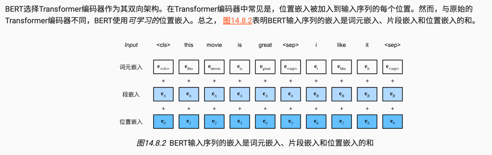

> BERT输入序列的嵌入是词元嵌入、片段嵌入和位置嵌入的和

    token_b = ["i", "like", "it"]
    token_c = ["i", "dont", "like", "it"]
    print(get_tokens_and_segments(token_a, token_b))
    print(get_tokens_and_segments(token_c))
    """
    (['<cls>', 'this', 'movie', 'is', 'great', '<sep>', 'i', 'like', 'it', '<sep>'], [0, 0, 0, 0, 0, 0, 1, 1, 1, 1])
    (['<cls>', 'i', 'dont', 'like', 'it', '<sep>'], [0, 0, 0, 0, 0, 0])
    """
### bert预训练包括以下两个任务：掩蔽语言模型和下一句预测。

掩码模型的原因
>https://blog.csdn.net/m0_59113542/article/details/129477722