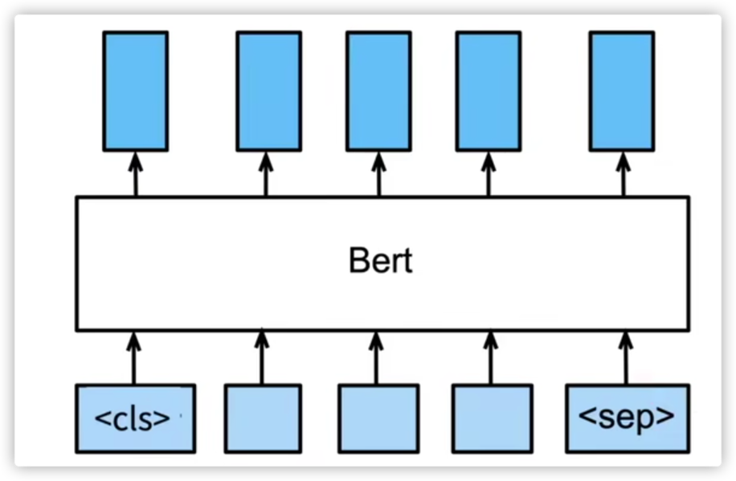
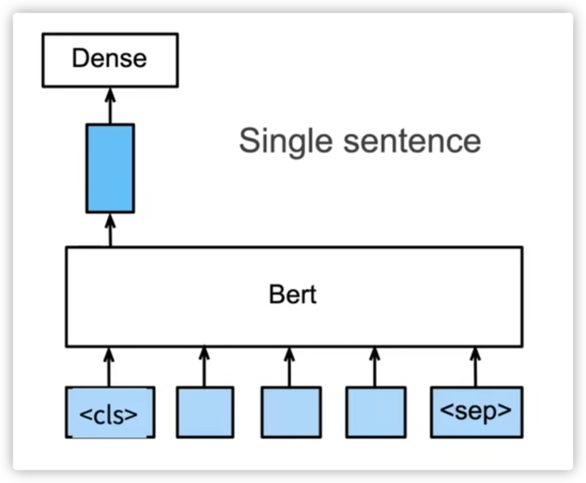
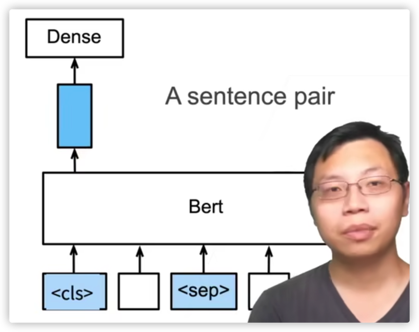
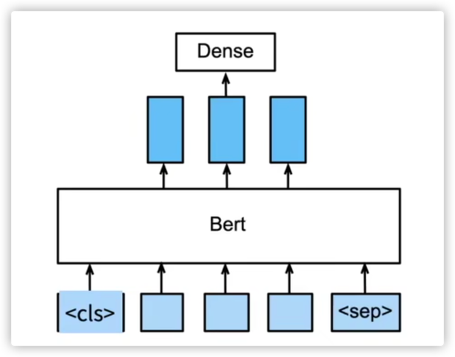
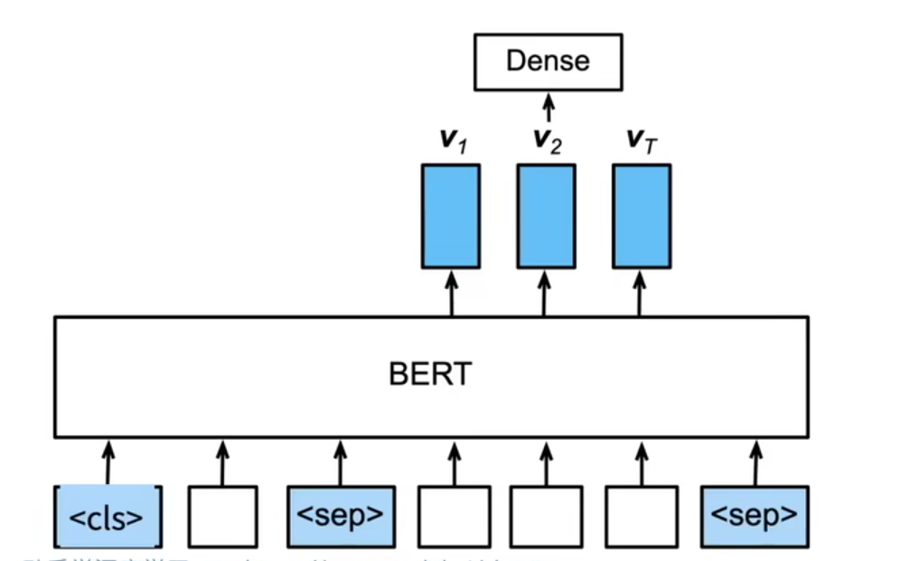
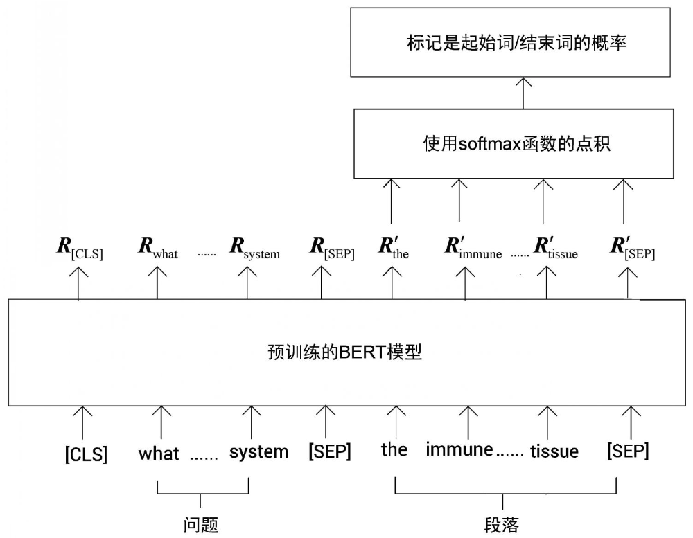

每个词都会有特征向量输出，且包含了上下文信息

## 句子分类

单句子的分类

将<cls> 对应的向量拿出来做分类就可以了
多句子的分类

> cls标识符包含了句子的信息

## 命名实体识别

将非特殊词元放进全联接层进行分类

## 问题回答
给定一个问题，和描述文字，找出一个片段作为回答 -》这样没有演绎能力，演绎能力若？

对片段中的每个词元预测它是不是回答的开头或者结束 ？？

> 找的一些资料
> 问答任务分为两种：

抽取式：从给定的上下文中抽取回答。
摘要式：从给定的上下文中生成对于问题正确的回答。（这个也差不多吧）
这里介绍抽取式：输入是一个问题和一个含有答案的段落，然后段落中提取答案。本质上讲是返回包含答案的文本段。
模型实际上预测的是答案在段落中的起始位置和结束位置的索引。

